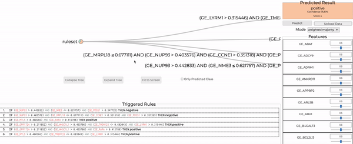
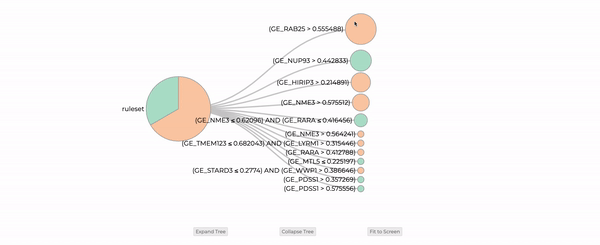

# REMIX: Rule Extraction Methods for Interactive eXplainability
Main repository for work our work with rule extraction methods from Deep Neural Networks (DNNs). This repository exposes a variety of methods for extracting rule sets from trained DNNs and a set of visualization tools for inspecting and using extracted rule sets.

## Credits

A lot of the code in this project is based on the work by Shams et al. made publicly available at [https://github.com/ZohrehShams/IntegrativeRuleExtractionMethodology](https://github.com/ZohrehShams/IntegrativeRuleExtractionMethodology) as part of their publication ["REM: An Integrative Rule Extraction Methodology for Explainable Data Analysis in Healthcare
"](https://www.biorxiv.org/content/10.1101/2021.01.22.427799v2.abstract).

Furthermore, this project has been build extensively on top of code open-sourced by Flexx.


## Setup
In order to install this library,  you will need the following requirements first:
- `python` 3.5 – 3.8
- `pip` 19.0 or later
- `R` 4.* needs to be installed and accessible in your machine. This is required as we use R's implementation of C5.0 with a `rpy2` wrapper.

Once you have installed R, you will also need to have the following packages installed in R:
- `C50`
- `Cubist`
- `reshape2`
- `plyr`
- `Rcpp`
- `stringr`
- `stringi`
- `magrittr`
- `partykit`
- `Formula`
- `libcoin`
- `mvtnorm`
- `inum`

If you have all of these, then you can install our code as a Python package using pip as follows:
```python
python setup.py install --user
```

This will install all required the dependencies for you as well as the entire project. Please note that this may take some time if you are missing some of the heavy dependencies we require (e.g TensorFlow).

**Important Note**: depending on your `python` distribution and environment (specially if you are using `pyenv` or a virtual environment), you may have to add `--prefix=` (nothing after the equality) to get this installation to work for you.

## Supported Rule Extraction Methods
Currently, we support the following algorithms for extracting rule sets from DNNs:
1. [DeepRED](https://link.springer.com/chapter/10.1007/978-3-319-46307-0_29) (Zilke et al. 2016): We support a variation of the DeepRED algorithm in which we use C5.0 rather than C4.5 for intermediate rule extraction. This results in generally better and smaller rule sets than those extracted by the original DeepRED algorithm.
2. [REM-D](https://www.biorxiv.org/content/10.1101/2021.01.22.427799v2.abstract) (Shams et al. 2020): This implementation is based on the original REM-D implementation by Shams et al. but includes several optimizations including multi-threading.
3. ECLAIRE (Espinosa-Zarlenga et al. 2021, publication pre-print in progress): Efficient CLAuse-wIse Rule Extraction allows you to extract rules from a DNN in a much more scalable way than REM-D/DeepRED while generally producing better performing and smaller rule sets. If working with large models or training sets, we strongly recommend using this method over REM-D or DeepRED as otherwise you may be prone to getting intractable runtimes in complex models.
4. PedC5.0 (Kola et al. 2020): Simple pedagogical rule extraction method in which C5.0 is used to approximate the output of a DNN using its input features.
5. [REM-T](https://www.biorxiv.org/content/10.1101/2021.01.22.427799v2.abstract) (Shams et al. 2020): This method allows you to extract rule sets from random forests or plain decision trees trained on a given task. As opposed to all other methods, this algorithm does not require a DNN and instead requires true labels for its training samples.
## Extracting Rules from Models

You can use a series of rule extraction algorithms with any custom Keras model trained on a **classification** task. To do this, you can import the following method once you have installed this package as instructed in the setup:

```python
from remix import eclaire # Or rem_d, pedagogical, rem_t, deep_red_c5
# Read data from some source
X_train, y_train = ...
# Train a Keras model on this data
keras_model = ...

# Extract rules from that trained model
ruleset = eclaire.extract_rules(keras_model, X_train)
# And try and make predictions using this ruleset
X_test = ...
y_pred = ruleset.predict(X_test)

# Or you can also obtain an explanation from a prediction
# Where `explanations` is a list of activated rules for each sample and
# `scores` is a vector containing their corresponding aggregated scores.
y_pred, explanations, scores = ruleset.predict_and_explain(X_test)

# You can also see the learned ruleset by printing it
print(ruleset)
```
All of the methods we support have the same signature where the first argument must be a trained Keras Model object and the second argument must be a 2D np.ndarray with shape `[N, F]` containing `N` training samples such that each sample has `F` features in it. Note that most of these methods are able to take a variety of hyper-parameters (e.g., the number of minimum samples required for making a new split in a decision tree can be passed via the `min_cases` arguments or the number of threads to use `num_workers`). For a full list of the hyper-parameters supported for a specific method, together with their semantics, please refer to that method's own documentation in [remix/extract_rules](remix/extract_rules).

## Visualizing Rule Sets

You can visualize, inspect, and make predictions with an extracted rule set using `remix`, our interactive visualization and inspection tool (NOTE: you need to be connected to the internet for this to work correctly). To do this, you will need to first serialize the rule set into a file which can be loaded into `remix`. You can do this by using
```python
ruleset.to_file("path_to_file.rules")
```
where a serialization path is provided. Note that by convention we use the `.rules` extension to serialize rule set files.

Once a file has been serialized, you can use `remix` by calling:
```bash
python visualize.py <path_to_file.rules>
```
and this will open up a new window in your default browser. This visualization tool includes 4 main windows as described below.

### Cohort Analysis Window


The cohort-wide analysis window provides a global view of the rule set in the form of 4 main plots:
1. A doughnut plot showing how many rules are used for each class in this rule set. This gives you an insight as to weather one class required more rules to be able to be identified than other classes. If you **hover** on top of a wedge of this plot you can get precise numbers of the number of rules for each class.
2. A bar plot showing the rule length distribution across all rule sets. You can toggle between the distributions of specific classes by **clicking** on a class' color in the plot's legend.
3. A bar plot showing how much a given feature is used across multiple rules in the rule set. These are sorted so that most used features are shown in the left. Note that each bar is split by taking into account the class that a rule using that feature predicts. To show more or less features, you can use the combo box on top of this plot to change how many features are displayed. To see specific counts, you can **hover** on top of any of the bars.
4. A bar plot showing how many unique terms are used in total across the entire rule set where each bar is further partitioned into separate classes. As in the feature plot, you can control how many terms are shown in the plot by changing this in the combo box on top of the plot. You can also see specific numbers for each feature by **hovering** on top of each bar.

Note that all of these plots are color-coded so that each possible output conclusion class in the input rule set is assigned one color.

### Prediction Window



This window will allow you to make new predictions by manually providing features of the sample you are trying to produce or by uploading a CVS file with the sample in it. Each prediction is further supported using two different views:
1. A visual tree representation of all the rules that got triggered by the sample where each intermediate note represents a term and each terminal node represents a specific rule's conclusion. In order to highlight connections across multiple rules, this graph is constructed in a greedy manner where we try and group terms that are more common in activated rules first.
2. A text representation where all the activated rules and their conclusions are explicitly shown.

Note that you can change how the prediction is done if you wish to use something else than majority class (e.g., highest confidence rule only). 

### Rule Explorer



This tree visualization offers a complete view of the rule set that was loaded into REMIX. As in the prediction window, this visualization of the entire rule set groups terms in a greedy fashion to construct an n-ary tree where each rule maps to a full root-to-leaf path. Note that each intermediate node also contains a pie chart that shows the distribution of rules beneath that node. If you hover on top of each node, further information about it will be provided.

The colors used for each class follow the same color-coding as done in the other windows.

### Rule Editor


The rule editor allows you to delete rules in the rule set that was loaded while also giving you an explicit text view of every rule in this rule set.


## Tests
We have also included a simple test that verifies the basic functionality of all the main tools and methods we introduce in this codebase. This testing suite is no way comprehensive but it helps making sure the main pathways are at least exercised and working. To run these tests, you need to run pytest as:

```bash
pytest test/test_rule_extractors.py -s
```